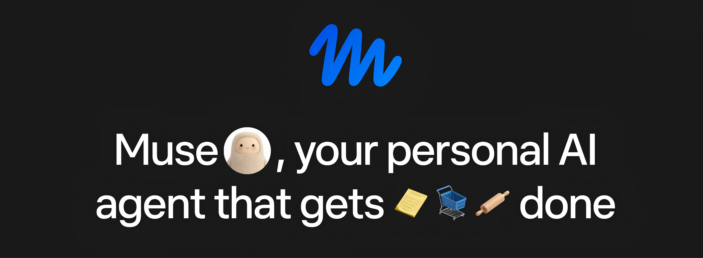

# ⚡ Meta Muse Spark — Desktop AI Studio & Multimodal Workspace

**Meta Muse Spark** is the official desktop client and multimodal creative studio from **Meta AI**. The application unifies Meta's advanced architectures (Llama, Chameleon, and Voicebox families) into a single local workspace for media generation, coding, deep document analysis, and automating complex agentic workflows.

  

---

## 🌟 Why Choose Meta Muse Spark?

Meta Muse Spark was designed by Meta AI as an alternative to isolated web services, providing users with the direct computing power of local GPUs and the Meta ecosystem.

* **🏛️ Direct Integration with Meta's Foundation Models:** Native support for Llama, Chameleon, and Meta multimodal engines without intermediaries, latency, or third-party API markups.
* **⚡ Local Acceleration (PyTorch & ExecuTorch):** Optimized for NVIDIA CUDA, AMD ROCm, and Apple Metal hardware acceleration. Computing and inference run at the maximum speed of your hardware.
* **🔒 Meta Open Source-Level Privacy:** Your files, prompts, local knowledge bases, and generated content are stored strictly on your device in encrypted form.
* **🎨 All-in-One Multimodal Synthesis:** A single workspace for working with text, code, audio generation and processing, image analysis, video, and 3D assets.
* **🌐 Seamless Meta Ecosystem Integration:** Import/export support for Meta Spark Studio projects, Ray-Ban Meta smart glasses, Meta Quest (AR/VR) devices, and Meta AI developer tools.
* **🧠 Massive Context Window (up to 1M+ Tokens):** Local processing of entire repositories, books, codebases, and hour-long audio recordings in a single prompt.
* **🛠️ Fully Autonomous & Offline Mode:** Ability to run locally quantized models (GGUF / EXL2) completely without an internet connection.

---

## 🚀 Desktop Client Installation

Download officially built distributions from the **Releases** section or the Meta AI Developer Portal.

### 🪟 Windows Setup (.exe)

**System Requirements:** Windows 10/11 (64-bit), NVIDIA GPU (6GB+ VRAM recommended) or AMD with ROCm / DirectML support.

1. Go to [Releases](../../releases) and download `Meta-Muse-Spark-x64.7z`.
2. Run the installer as an administrator.
3. In the setup wizard, select the acceleration type:
* **NVIDIA CUDA** *(recommended for RTX cards)*.
* **DirectML / CPU** *(for integrated GPUs and non-NVIDIA systems)*.

4. Wait for the extraction of PyTorch libraries and native drivers to complete.
5. Launch **Meta Muse Spark** via the desktop shortcut.

---

### 🍎 macOS Setup (.dmg)

**System Requirements:** macOS Monterey 12.0 or newer. Optimized for **Apple Silicon (M1/M2/M3/M4)**.

1. Download the installer `Meta-Muse-Spark-macOS.dmg` from [Releases](../../releases).
2. Mount the `.dmg` image and drag the **Meta Muse Spark** icon into the **Applications** folder.
3. On first launch on Apple Silicon, the app automatically utilizes **Apple Metal Performance Shaders (MPS)** and the **Neural Engine**.
4. *(If Gatekeeper warning appears)*: Hold `Control` ➔ click the app icon ➔ select **Open**.

---

## 🔍 Complete Feature Overview (From A to Z)

### 1. 🧠 Meta AI Multimodal Core

* **Hybrid Inference:** Switch seamlessly between local inference (powered by your PC) and Meta AI high-performance cloud clusters.
* **Context Management:** Graphical monitor for VRAM usage and context memory with dynamic trimming and history compression.
* **Multi-Agent Mode (Meta Agentic Workflows):** Create networks of specialized agents where one writes code, a second tests it, and a third formats documentation.

### 2. 🎨 Creative Studio & Media Generation

* **Image Generation & Editor:** Graphic creation and inpainting with support for layer-based editing.
* **Computer Vision Analysis:** Recognition of complex diagrams, blueprints, charts, handwritten text, and UI layouts.
* **AR/VR Asset Preparation:** Export generated 3D objects and textures directly into formats compatible with Meta Quest and Meta Spark Studio (.gltf, .fbx).

### 3. 🎙️ Audio & Voice Studio (Voicebox Engine)

* **High-Definition Text-to-Speech (TTS):** Voice cloning and speech generation with precise emotional inflection, cadence, and pauses.
* **Speech-to-Text (STT) & Transcription:** Instant transcription of long audio recordings, calls, and podcasts with speaker diarization.
* **Dubbing & Localization:** Automated translation and re-voicing of video/audio assets while preserving original voice timbre.

### 4. 💻 Coding, Visual Sandbox & Development

* **Interactive Sandbox (Live Code Execution):** Safe execution of generated Python, JavaScript, C++, and Rust code directly inside the application.
* **Visual Coding & UI Preview:** Generate React, Vue, and HTML/CSS components with an instant side-by-side preview window.
* **Git & IDE Integration:** Sync with local repositories, automated commit generation, pull requests, and unit testing.

### 5. 📄 Knowledge Base & Data Processing (RAG & BYOS)

* **Local RAG (Retrieval-Augmented Generation):** Index your local folders, PDF files, Notion, or Obsidian knowledge bases without transmitting data over the network.
* **Table & Big Data Analysis:** Direct processing of massive `.csv`, `.xlsx`, and `.parquet` files with automatic generation of analytical charts and graphs.
* **Web Scraping & Summarization:** Built-in clean parser to convert web pages and articles into structured summaries.

### 6. 🎭 Role Library & Personalization

* **Pre-configured Meta AI Profiles:** System instruction presets for software architects, research scientists, copywriters, 3D artists, and legal advisors.
* **Custom System Prompt Builder:** Fine-tune temperature, top_p, penalty parameters, and Chain-of-Thought reasoning steps for specific tasks.

### 7. 🎛️ Settings, Themes & Security

* **19 Engineering & Design Themes:** Including high-contrast dark themes (Meta Dark, Cyberpunk, OLED Black) and light workspaces.
* **Data Encryption:** Protection of local SQLite database using AES-256 encryption.
* **Flexible Export:** Save chat history, reports, and generated media to PDF, Markdown, HTML, or JSON formats.

---

## 🛠️ System Requirements

| Parameter | Minimum (Cloud/API Mode) | Recommended (Local Inference) |
| --- | --- | --- |
| **OS** | Windows 10 (64-bit) / macOS 12.0 | Windows 11 / macOS 14.0+ |
| **CPU** | Intel Core i5 / AMD Ryzen 5 / Apple M1 | Intel Core i7/i9 / AMD Ryzen 9 / Apple M2/M3/M4 Pro/Max |
| **RAM** | 8 GB | 32 GB or more |
| **GPU** | Any with DirectX 12 / Metal support | NVIDIA RTX 3080 / 4080 (12GB+ VRAM) or Apple Silicon Unified Memory 36GB+ |
| **Disk** | 2 GB free space | 50 GB+ NVMe SSD (for storing local model weights) |

---

## 📜 License and Terms of Use

The project is distributed under the **Meta Community License**. The client source code is available for modification and community audit. See the [LICENSE](LICENSE) file for details.
